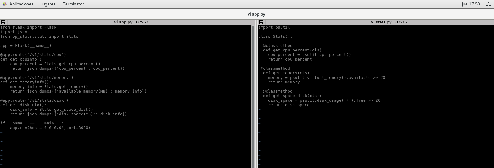
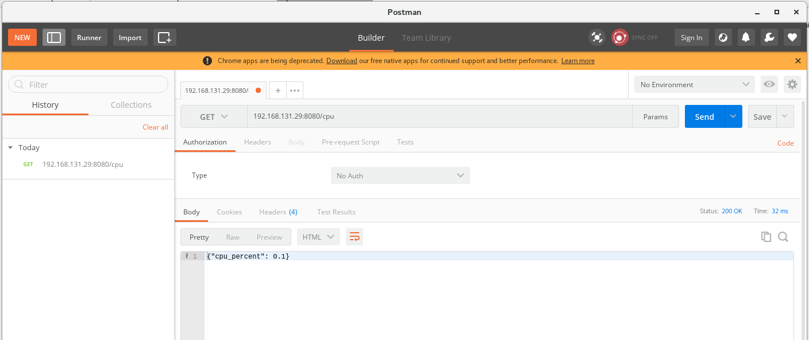
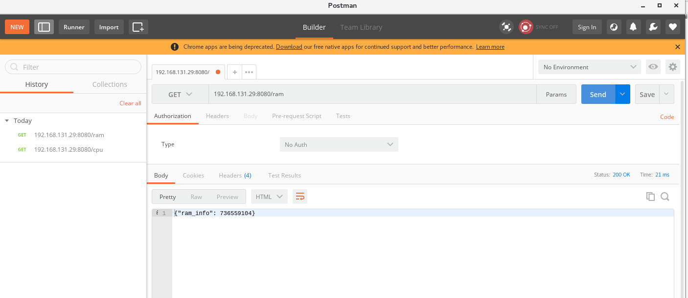
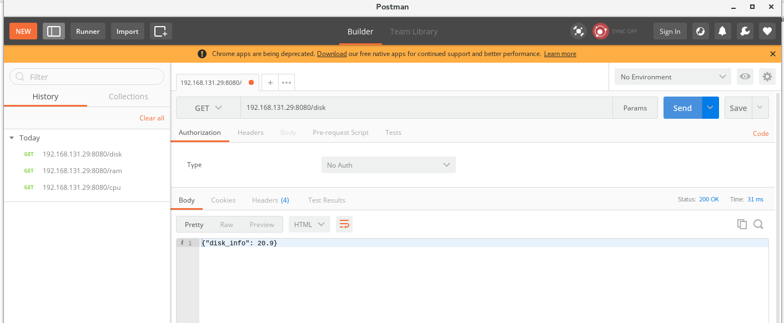
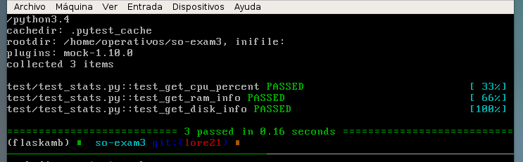
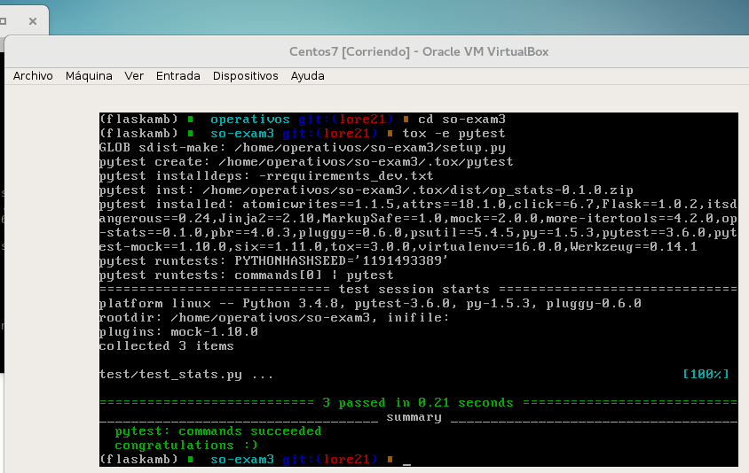
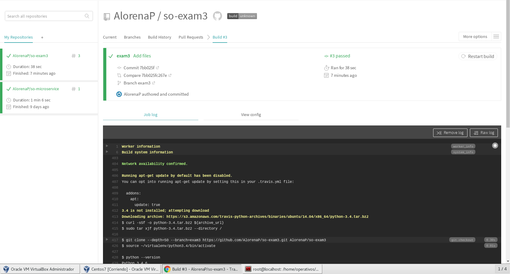
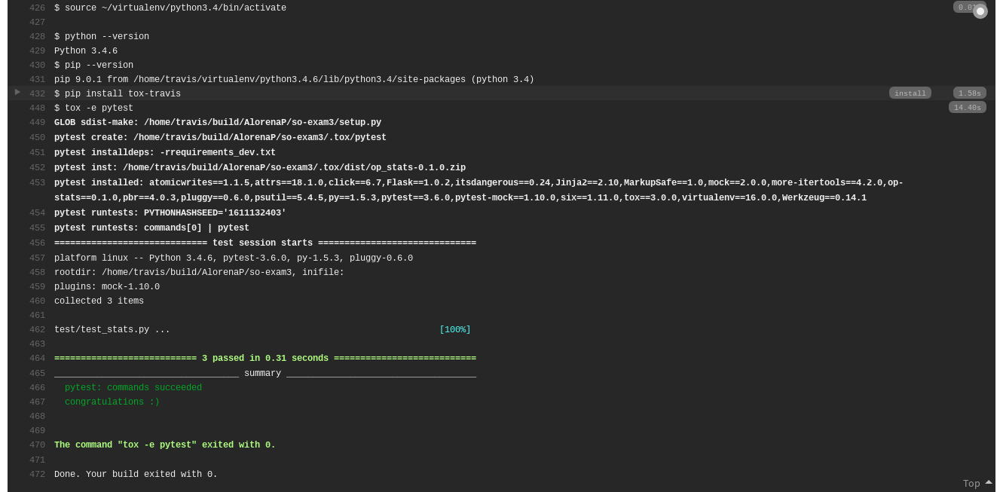

# so-exam3

**Nombre:** Angie Lorena Pérez    
**Código:** A00242068  
**Materia:** Sistemas operacionales  
**Correo:** lorena9221@hotmail.com  
**Repositorio:** https://github.com/AlorenaP/so-exam3


# 3 
Implementación de un servicio web en Flask que cumpla las siguientes condiciones:
Se crea un ambiente virtual para el desarrollo el cual contiene las dependencias necesarias, con el comando 

```$ python3 -m venv flaskamb ```

flaskamb es el nombre del ambiente virtual que se va a usar el cual se activa con el comando,

``$ source flaskamb/bin/activate``

luego se agregan los archivos requirements.txt y requirements_dev.txt utilizando el codigo fuente que esta almacenado en el repositorio de microservices. Luego la carpeta **op_stats** va contener los archivos de python llamados app.py(en este archivo se se crean los métodos que permiten realizar la implementación del servicio web de flaksk) y el stats.py (en este archivo se encuntran los metodos que retornan los estados de la memoria, disco duro y la CPU)

En la clase app.py y en stats.py

 

Ahora en postman se evidencia el funcionamiento del API haciendo las peticiones

  - Para CPU
  
  
  - Para RAM
  
  
  - Para Disco
  
  
  
 # 4
 Para las pruebas unitareas se crea el archivo llamado test_stats.py que contiene las pruebas unitarias del servicio. Estas
 se corren usando el comando de pytest, el cual busca las pruebas disponibles dentro del directorio:
 
 ``$ pytest -v``
 
 
 **obteniendo**
 
 
 
 # 5 
 Para el servicio de integracion continua se usa travis. S crea el archivo tox.ini donde se especifican las dependencias que se van a usar.
 
 con el comando tox -e pytest, se ejecutan las pruebas:
 
 
 
 finalmente se crea el archivo .travis.yml, que guardara la configuracion basica para correr las pruebas por travis-ci.org y asi validar cada commit realizado
 
 
 

